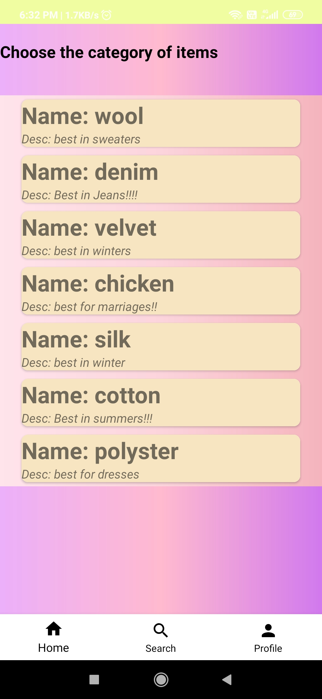
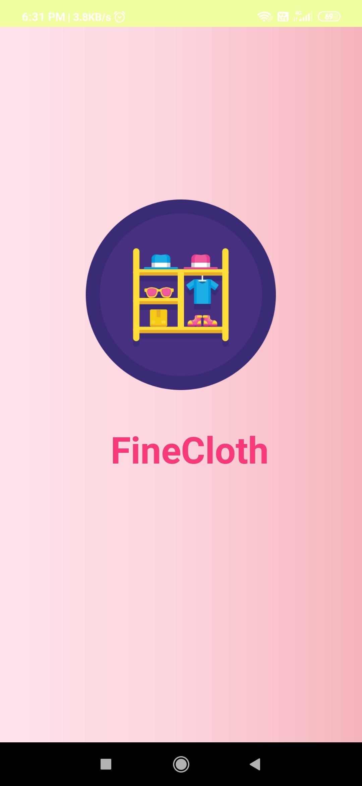
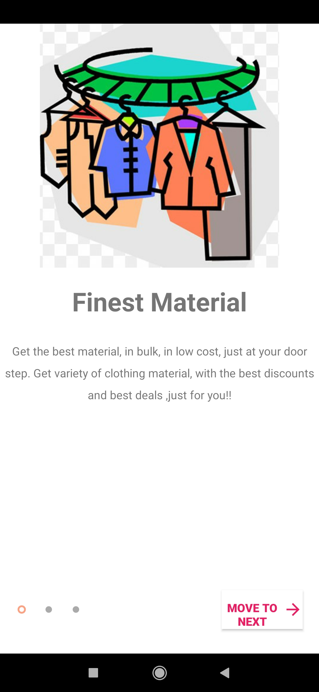
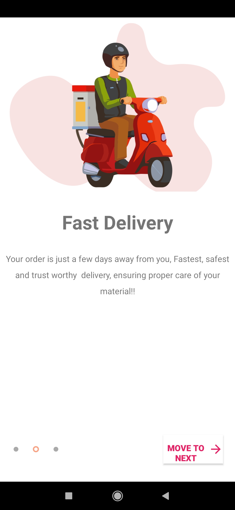
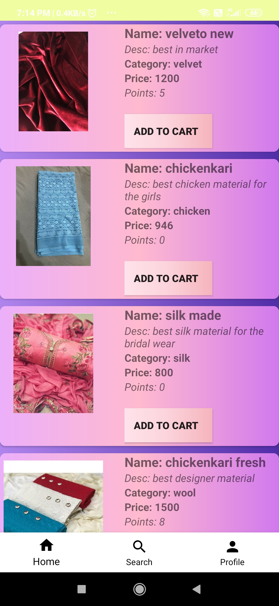
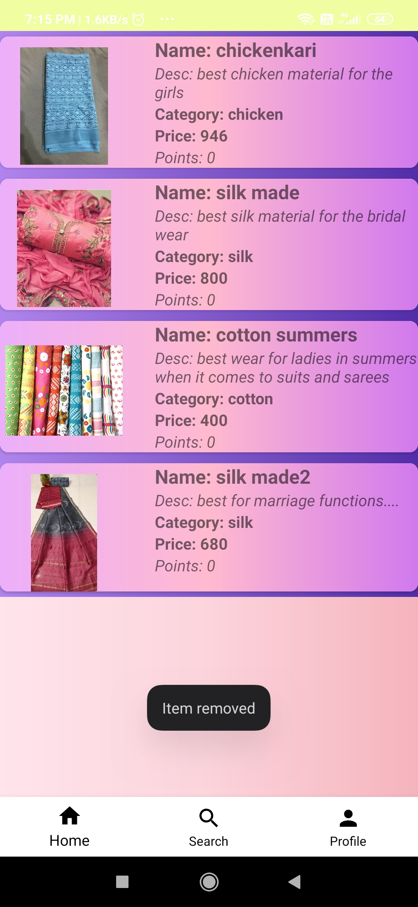
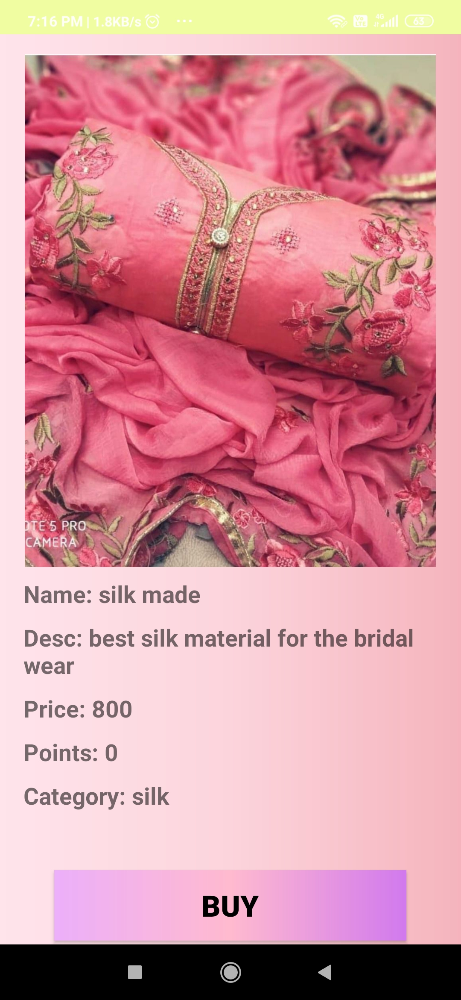

# FineCloth
An e commerce android application especially designed for clothing materials in specific to boutiques!!!
Features-

## Admin App-
1) Add new Category
2) Add new Item - Upload data and images to Firebase Firestore and Firebase Storage
3) View suggestions and View orders

## Customer App-
1) Add to Cart
2) Buy an item
3) Payment Gateway- RazorPay API
4) Search item according to category
5) View items in Cart
6) View all the orders
7) Firebase Firestore and Firebase Storage

# Screenshots

# Admin
## admin dashboard

## item dashboard

## add new item

## upload image

## category dashbaord

## add new category

## view all categories

## customer dashboard

## view all suggestions

## view all orders

# Customer
## splash

## welcome screens

 

## register

## log in

## customer home page

## customer profile

## cart

## buy

## order details

## search by category 

